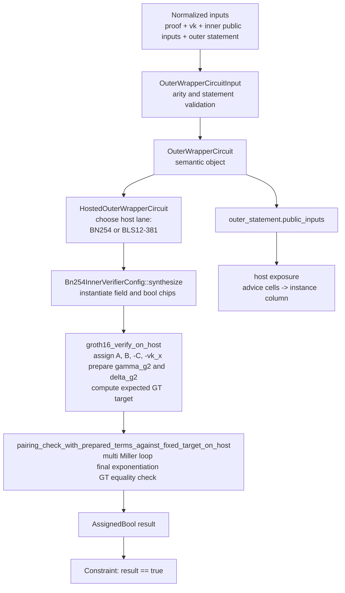

# Outer Wrapper Circuit: Layered Walkthrough

## Scope

This note describes the circuit that exists today in this repository.

Current scope:

- inner proof system: narrow Groth16 over BN254
- outer semantic circuit: `OuterWrapperCircuit`
- outer host lanes: BN254 and BLS12-381
- outer public statement semantics: mirror of the ordered inner public inputs
  plus one public commitment to the inner verification key

## Statement Proven by the Outer Circuit

The canonical outer circuit proves three facts:

1. the supplied Groth16 BN254 proof verifies against the supplied verification
   key and ordered public inputs
2. the outer public statement exposed by the outer circuit matches the ordered
   inner public inputs according to the current statement semantics
3. the supplied inner verification key hashes to the public VK commitment
   carried by the outer statement

In the current phase, the statement semantics are explicit but still narrow:

- the outer statement contains one explicit mirrored inner public-input component
- the outer statement contains one explicit VK-commitment component

The outer proof therefore does not prove a transformed application statement.
It proves validity of the inner verifier relation, faithful re-exposure of the
selected public-input view, and binding of that proof check to one publicly
identified inner verification key.

## High-Level Structure

The implementation is split into five layers:

1. input and statement contract
2. semantic outer circuit
3. host-lane wrapper
4. narrow Groth16 verifier
5. BN254 pairing core

The relevant files are:

- `crates/wrapper-circuits/src/outer/input.rs`
- `crates/wrapper-circuits/src/outer/statement.rs`
- `crates/wrapper-circuits/src/outer/mod.rs`
- `crates/wrapper-circuits/src/outer/semantics.rs`
- `crates/wrapper-circuits/src/outer/hosted.rs`
- `crates/wrapper-circuits/src/outer/host/`
- `crates/wrapper-circuits/src/groth16.rs`
- `crates/wrapper-circuits/src/bn254/g2/miller.rs`
- `crates/wrapper-circuits/src/bn254/fp2.rs`
- `crates/wrapper-circuits/src/bn254/fp6.rs`
- `crates/wrapper-circuits/src/bn254/fp12.rs`

## Dataflow Diagram

## Layer 1: Input Contract

`OuterWrapperCircuitInput` is the canonical input type for the outer circuit.

It contains:

- `inner_proof`
- `inner_verification_key`
- `inner_public_inputs`
- `outer_statement`

This object sits after artifact parsing and normalization. The circuit does not
consume `snarkjs` JSON directly. That work belongs to backend code.

### Validation

`OuterWrapperCircuitInput::validate()` enforces:

1. `vk.ic.len() == inner_public_inputs.len() + 1`
2. the outer statement satisfies the active statement semantics
3. the public VK commitment equals the canonical commitment of the supplied
   normalized verification key

The first check guards the verifier-side IC accumulation contract.

The second and third checks guard the outer statement boundary. In the current
phase they mean:

- mirrored public-input arity must equal inner public-input arity
- mirrored public-input values must equal the inner public-input values
- the semantic VK commitment field must be present and named `vk_commitment`
- the flattened public statement must match the explicit mirrored-input and
  VK-commitment components
- field-name counts must match value counts

## Layer 2: Outer Statement Semantics

`OuterStatementInput` stores:

- `semantics`
- `mirrored_field_names`
- `mirrored_public_inputs`
- `vk_commitment`
- flattened `field_names`
- flattened `public_inputs`

The only currently implemented semantics are:

- `MirrorInnerPublicInputsAndVerificationKeyCommitment`

The flattened public-input vector is still what Halo2 exposes, but it is now a
derived projection of an explicit semantic statement rather than the statement
itself.

Current flattening rule:

- mirrored inputs keep their caller-supplied names and order
- the VK commitment is one semantic BN254 field element
- that field element is flattened to canonical host-lane limbs named
  `vk_commitment_limb_0`, `vk_commitment_limb_1`, and so on
- that semantic field element is produced by a Poseidon x^5 based commitment
  over the canonical normalized VK coordinate stream

This is a narrow but explicit contract. The outer circuit does not decide what
the public statement means at synthesis time. The meaning is fixed in the input
object and checked before and during synthesis.

## Layer 3: Semantic Circuit vs Host-Lane Circuit

`OuterWrapperCircuit` is not the host-lane-specific Halo2 circuit. It is the
semantic circuit object.

It stores:

- `config`
- `flavors`
- `input`

It answers questions such as:

- what semantic claim is being made
- what host lane is selected
- whether the circuit input is valid for synthesis

Actual `Circuit<F>` implementations live in the hosted wrappers:

- `HostedOuterWrapperCircuitBn254`
- `HostedOuterWrapperCircuitBls12`

This split keeps the semantic circuit independent from the choice of host
field.

## Layer 4: Host-Lane Boundary

The current outer proof can be hosted on:

- BN254
- BLS12-381

The inner verifier semantics remain BN254 in both cases.

That means the implementation distinguishes between:

- the field in which the inner proof system lives
- the field in which the outer Halo2 proof is hosted

### BN254 host lane

`HostedOuterWrapperCircuitBn254` uses:

- `MidnightBn254HostConfig`
- `Bn254InnerVerifierConfig<NativeField>`

The outer statement is already expressed in the host field, so the public-input
exposure path is direct.

### BLS12-381 host lane

`HostedOuterWrapperCircuitBls12` uses:

- `MidnightBls12_381HostConfigShell`
- `Bn254InnerVerifierConfig<Bls12HostField>`

The inner verifier still works over BN254 values represented non-natively in
the BLS12-381 host field. The outer statement values are lifted into the host
field by preserving their canonical integer value.

That lifting is done by:

- `lift_outer_input_to_host`
- `lift_outer_inputs_to_host`

## Layer 5: Semantic Synthesis Entry Point

The semantic bridge is `Bn254InnerVerifierConfig::synthesize`.

This method:

1. creates the BN254 field chip
2. creates the BN254 boolean chip
3. assigns the witness-side verification key into non-native BN254 coordinates
   and recomputes the canonical VK commitment in-circuit
4. constrains that computed commitment to equal the public statement's explicit
   VK commitment
5. runs `groth16_verify_on_host(...)`
6. constrains the resulting boolean to `true`
7. loads deferred chip state

This is the point where a computed verifier result becomes a hard circuit
constraint and where the public VK binding becomes a hard circuit constraint.

The outer proof does not publish a verifier-result bit. Satisfiable synthesis
already implies acceptance of the inner proof.

## Field Tower

The pairing core is built on the BN254 extension-field tower:

`Fp ⊂ Fp2 ⊂ Fp6 ⊂ Fp12`

The tower used in this repository matches the standard arkworks BN254
construction.

### Base field: `Fp`

`Fp` is the BN254 base field. In the codebase this appears as circuit-backed
assigned non-native base-field values over the selected host field.

Role:

- coordinates and arithmetic for BN254 base-field operations
- base representation for G1 coordinates
- foundation for all higher extension fields

### Quadratic extension: `Fp2`

`Fp2` is represented as:

`a + b u`

with:

`u^2 = -1`

Role:

- coordinates for BN254 G2
- line-function coefficients in the Miller path
- base layer for `Fp6`

Implementation surface:

- `AssignedFp2`
- `add`, `sub`, `neg`, `mul`, `square`
- equality helpers

### Cubic extension over `Fp2`: `Fp6`

`Fp6` is represented as:

`c0 + c1 v + c2 v^2`

with:

`v^3 = 9 + u`

Role:

- intermediate tower level needed for `Fp12`
- support for sparse multiplication patterns used by pairing arithmetic

Implementation surface:

- `AssignedFp6`
- `add`, `sub`, `neg`, `mul`, `square`

### Quadratic extension over `Fp6`: `Fp12`

`Fp12` is represented as:

`c0 + c1 w`

with:

`w^2 = v`

Role:

- target field of the BN254 pairing
- carrier field for Miller accumulators
- field in which final exponentiation is performed
- field in which the final GT equality check is expressed

Implementation surface:

- `AssignedFp12`
- `add`, `sub`, `neg`, `mul`, `square`
- comparison against fixed constants

## Why the Tower Matters for the Circuit

The tower is not background theory. It determines the concrete circuit layers
needed by the verifier.

Dependency order:

1. the inner verifier requires pairing arithmetic
2. pairing arithmetic requires G2 and GT operations
3. G2 requires `Fp2`
4. GT requires `Fp12`
5. `Fp12` requires `Fp6`
6. `Fp6` requires `Fp2`
7. `Fp2` requires `Fp`

So the verifier stack is structurally downstream from the field tower. The
outer circuit can only synthesize Groth16 verification because the repository
already implements the tower needed by the pairing core.

## Where the Tower Appears in the Pairing Path

The current pairing core uses the tower in the following way:

- G1 points live over `Fp`
- G2 points live over `Fp2`
- Miller line coefficients are sparse `Fp2` values
- line evaluation embeds those coefficients into selected `Fp12` slots
- the Miller accumulator lives in `Fp12`
- final exponentiation is an `Fp12` computation
- the final equality check compares an `Fp12` value against a fixed `Fp12`
  constant

The current sparse line layout is the BN254 D-twist layout:

- `(ell_0, ell_w, ell_vw)`

Evaluated at a G1 affine point `(x_P, y_P)`, the line contributes:

`ell_0 * y_P + ell_w * x_P * w + ell_vw * v * w`

That expression is sparse in `Fp12`, which is why the current Miller
accumulator API can exploit specialized line-consumption paths instead of
falling back to a completely generic dense `Fp12` multiplication at every step.

## Layer 6: Narrow Groth16 Verifier

`groth16_verify_on_host(...)` is the verifier entry point used by the outer
circuit semantics.

Its steps are:

1. validate public-input shape
2. assign `A` in G1
3. assign `-C` in G1
4. compute `vk_x`
5. assign `-vk_x` in G1
6. assign `B` in G2
7. prepare constant G2 Miller schedules for `gamma_g2` and `delta_g2`
8. compute the fixed GT target `e(alpha, beta)`
9. run the pairing-product check

### `vk_x`

The verifier-side accumulator is:

`vk_x = IC_0 + Σ public_input_i * IC_i`

The current implementation uses the verifier-specific path
`groth16_accumulate_ic(...)`. It is intentionally narrow. It is not yet a broad
public MSM abstraction for G1.

## Layer 7: Groth16 Equation Reduction

The standard verifier equation is:

`e(A, B) = e(alpha, beta) * e(vk_x, gamma) * e(C, delta)`

The current circuit checks the equivalent reduced form:

`e(A, B) * e(-vk_x, gamma) * e(-C, delta) = e(alpha, beta)`

This reduction matters for two reasons:

1. `e(alpha, beta)` becomes a fixed GT target
2. the left-hand side becomes one product consumed by one shared final
   exponentiation

This is the current verifier-shaped pairing boundary used throughout the repo.

## Layer 8: Variable and Constant Pairing Terms

At the pairing boundary, the verifier is split into:

- one variable full pairing term:
  - `e(A, B)`
- two terms with variable G1 input and constant prepared G2 input:
  - `e(-vk_x, gamma)`
  - `e(-C, delta)`
- one fixed GT target:
  - `e(alpha, beta)`

This split is reflected directly in the current call structure:

- variable terms: `(&AssignedG1Point, &AssignedG2Affine)`
- prepared terms: `(&AssignedG1Point, &PreparedConstantG2Miller)`
- target: `Fp12Constant`

## Layer 9: Prepared Constant G2 Terms

`PreparedConstantG2Miller` is the key constant-verifier-term optimization
boundary.

It does not merely store a constant affine G2 point. It stores the fixed
prepared Miller schedule derived from that point.

As a consequence:

- the circuit avoids recomputing the G2 traversal schedule for verifier-key
  constants
- the pairing loop consumes ready-to-use Miller data
- the remaining variability stays in the G1 side for `-vk_x` and `-C`

This is already used for:

- `gamma_g2`
- `delta_g2`

## Layer 10: Pairing-Core Check

The current verifier path calls:

- `pairing_check_with_prepared_terms_against_fixed_target_on_host(...)`

This function performs:

1. `multi_miller_loop_with_prepared_terms_on_host(...)`
2. `final_exponentiation_on_host(...)`
3. `fp12_equals_fixed_on_host(...)`

This shape is significant.

The circuit does not final-exponentiate per pairing term. It multiplies all
Miller outputs first, then applies one shared final exponentiation to the total
product.

That is the correct verifier-shaped strategy for the current narrow
multi-pairing check.

## Layer 11: Public-Input Exposure

After semantic synthesis succeeds, the hosted circuit exposes the outer
statement values as public inputs.

The host config does this in two steps:

1. assign each statement value into advice
2. constrain each advice cell against the instance column row by row

This is done by:

- `MidnightBn254HostConfig::expose_outer_statement(...)`
- `MidnightBls12_381HostConfigShell::expose_outer_statement(...)`

The semantic content is the same in both lanes. Only the host field changes.

## Layer 12: Public vs Private Data

Current public data:

- `outer_statement.public_inputs`

Current witness-side data:

- `inner_proof`
- `inner_verification_key`
- `inner_public_inputs`

This means the outer proof is currently a proof of:

- private inner-verifier witness material
- public mirrored statement values

## Layer 13: Constraint Shape in Operational Terms

The operational shape of the current circuit can be summarized as:

1. validate the semantic input contract
2. synthesize the BN254 Groth16 verifier non-natively over the selected host
   field
3. reduce the verifier to a pairing-product equation
4. evaluate the product through the BN254 field tower up to `Fp12`
5. constrain the result to the fixed GT target
6. expose the mirrored outer statement publicly

Every layer above the pairing core depends on the lower arithmetic layers being
present and correctly wired.

## Reading Order

For code-level follow-up, use this order:

1. `crates/wrapper-circuits/src/outer/input.rs`
2. `crates/wrapper-circuits/src/outer/statement.rs`
3. `crates/wrapper-circuits/src/outer/mod.rs`
4. `crates/wrapper-circuits/src/outer/semantics.rs`
5. `crates/wrapper-circuits/src/outer/hosted.rs`
6. `crates/wrapper-circuits/src/groth16.rs`
7. `crates/wrapper-circuits/src/bn254/fp2.rs`
8. `crates/wrapper-circuits/src/bn254/fp6.rs`
9. `crates/wrapper-circuits/src/bn254/fp12.rs`
10. `crates/wrapper-circuits/src/bn254/g2/miller.rs`
